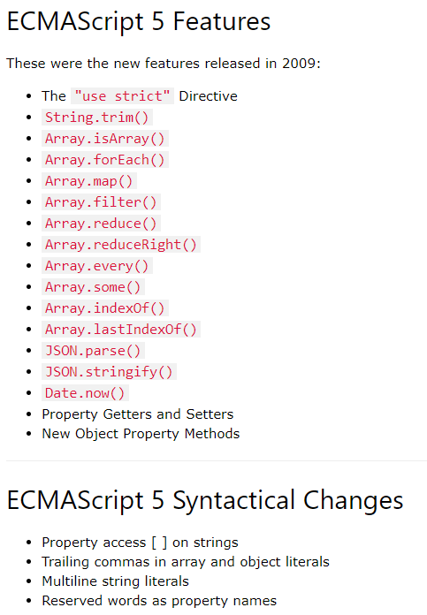

## 前端

### JavaScript

- [函数防抖与函数节流](./前端/JavaScript/函数防抖与函数节流.md)
- [高阶函数、闭包、偏函数、坷里化概念](./前端/JavaScript/高阶函数、闭包、偏函数、坷里化概念.md)
- [闭包的应用](./前端/JavaScript/闭包.md)
- [JavaScript OOP(1)ES5中的属性](./前端/JavaScript/JavaScript%20OOP(1)ES5中的属性.md)
- [JavaScript OOP(2)封装(创建对象)](./前端/JavaScript/JavaScript%20OOP(2)封装(创建对象).md)
- [JavaScript OOP(3)继承](./前端/JavaScript/JavaScript%20OOP(3)继承.md)

#### 变量与数据类型

- [JavaScript-类型检测](./前端/JavaScript/JavaScript-检测类型.md)
- [JavaScript浅拷贝与深拷贝](./前端/JavaScript/JavaScript浅拷贝与深拷贝.md)
- [JavaScript传参方式](./前端/JavaScript/JavaScript传参方式.md)

#### ES5

- 严格模式(use strict)

  > 严格模式可以应用到**整个脚本**或**个别函数**中。不要在封闭大括弧 `{}` 内（代码块内）这样做，在这样的上下文中这么做是没有效果的。 

  在使用严格模式时：

  - 禁止给未声明的变量赋值
  - 静默失败升级为错误（删除不可删除的属性、函数参数名不唯一等）
  - 禁止八进制数字语法
  - ECMAScript 6中的严格模式禁止设置[primitive](https://developer.mozilla.org/en-US/docs/Glossary/primitive)值的属性 
  - 禁用with
  - arguments, arguments.callee不推荐使用
  - 对于一个开启严格模式的函数，指定的`this`不再被封装为对象，而且如果没有指定`this`的话它值是`undefined` 
  - [更多...](https://www.w3schools.com/js/js_strict.asp)

- [bind、call/apply函数详解](./前端/JavaScript/ES5%20bind()、call()、apply()函数详解.md)
- [数组API](./前端/JavaScript/ES5中的数组API.md)
- [ES5之对象属性](./前端/JavaScript/JavaScript%20OOP(1)ES5中的属性.md)

#### 其它

- [ngrok1.7实现内网穿透踩坑](./前端/其它/ngrok1.7实现内网穿透踩坑.md)
- [微信公众号网页开发笔记](./前端/其它/微信公众号网页开发手记.md)
- [WebComponent学习笔记](./前端/HTML/Web%20Component学习笔记.md)

### CSS

