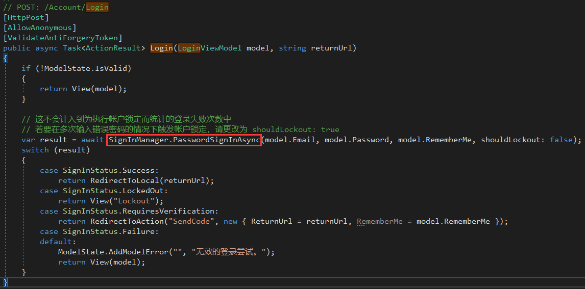
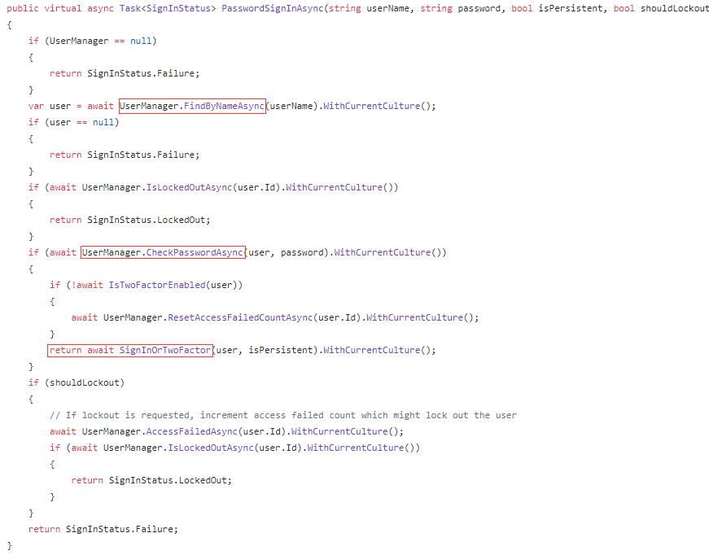
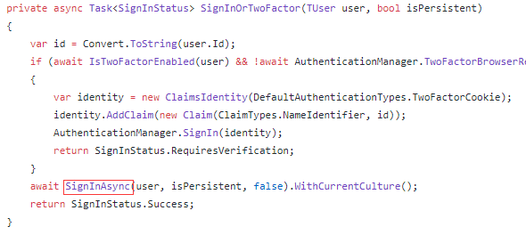
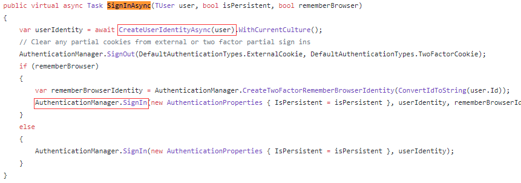

> 本文是记录我看[MVC5 - ASP.NET Identity登录原理 - Claims-based认证和OWIN](https://www.cnblogs.com/jesse2013/p/aspnet-identity-claims-based-authentication-and-owin.html)这篇文章的理解过程，记下来备忘。

## 查看源码

使用VS2017创建一个MVC5项目（启用个人账号验证），VS会自动生成模板代码，在`AccountController.cs`中登录请求的方法如下图：


该控制器方法中使用调用了`SignInManager.PasswordSignInAsync`方法兵返回一个是否登录成功的结果。该方法的命名空间为`Microsoft.AspNet.Identity.Owin`，查看[源码](https://github.com/aspnet/AspNetIdentity/blob/master/src/Microsoft.AspNet.Identity.Owin/SignInManager.cs)如下：




在`PasswordSignInAsync`方法中验证用户名密码成功后，调用`SignInOrTwoFactor`方法：






从上面的这几段代码中，在IsTwoFactorEnabled默认为false的情况下，可以看出登录的流程大体如下：

1. 验证用户名密码是否正确`UserManager.FindByNameAsync`和`UserManager.CheckPasswordAsync`
2. 验证成功后获取用户信息（类型为`ClaimsIdentity`）。
3. 调用登录方法`AuthenticationManager.SignIn(AuthenticationProperties properties, params ClaimsIdentity[] identities)`生成登录成功的票据。


先看`ClaimsIdentity`以及`ClaimsPrincipal`这两个类，

- `ClaimsIdentity`继承自`IIdentity`：

    ```C#
    // 定义标识对象的基本功能。
    public interface IIdentity
    {
        // 当前用户的名称。
        string Name { get; }
    
        // 使用的身份验证的类型。
        string AuthenticationType { get; }
    
        // 指示是否已验证用户。
        bool IsAuthenticated { get; }
    }
    ```

- `ClaimsPrincipal`继承自`IPrincipal`

  ```C#
  // 定义主体对象的基本功能。
  public interface IPrincipal
  {
      // 获取当前主体的标识。
      IIdentity Identity { get; }
  
      // 确定当前用户是否属于指定角色。
      bool IsInRole(string role);
  }
  ```

  **IPrincipal** 代表着一个安全上下文，这个安全上下文对象包含了上面的identity以及一些角色和组的信息,每一个线程都会关联一个Principal的对象，但是这个对象是属性进程或者AppDomain级别的。ASP.NET自带的 RoleProvider就是基于这个对象来实现的。

## Claims Based Authentication

### what is claim

> **Claim**是描述给定身份(用户)在某些方面的信息。**Claims**是Claim的集合，用来描述给定身份多个方面的信息。Claims保存在具有签名的token中，因此可以确保在传输的过程中不回被篡改。可以将token视为包含Claims的信封。

### Claims Based Authentication

>基于声明的身份验证是更通用的身份验证机制，允许用户在外部系统上进行身份验证，从而向系统询问有关用户的声明。
>
>简单的来说，就是把登录的代码（验证用户，获取用户信息）拆分成独立的服务或组件，调用这个组件/服务后，我们就可以拿到用户信息


### How Claims Based Authentication works?

1）用户向Identity Provider请求token（即登录请求）

2）验证认证信息

3）验证成功后，获取用户信息，生成Claims Identity

4）根据Claims Identity生成token，返回token给用户

5）用户拿到token后，使用token向应用服务器发起请求

6）验证token签名和token来源的权威性

7）验证通过后就可以使用token中的claims identity


## OWIN

第三步的AuthenticationManager的实现在[Katana](https://github.com/aspnet/AspNetKatana)项目的`Microsoft.Owin.Security`命名空间中，而Katana是微软官方对OWIN的实现。

### 什么是OWIN

> [OWIN](http://owin.org/)（Open Web Interface for .NET）**定义**了.NET Web服务器和Web应用程序之间的标准**接口**。 OWIN接口的目标是分离**服务器**和**应用程序**（降低耦合度），鼓励开发用于.NET Web开发的简单模块，并且通过开放标准，激发.NET Web开发工具的开源生态系统。

### 为什么需要解耦服务器**和**应用程序?

ASP.NET web应用程序高度依赖于IIS服务器（如自定义http module注册到IIS来处理事件，经常用到HttpContext，HttpApplicationt等对象都需要从IIS中获取信息）。

### OWIN如何解耦？

> 我们上面说Owin是一套定义，它通过将服务器与应用程序之间的交互归纳为一个方法签名，称之为“应用程序代理（application delegate）”。在一个基于Owin的应用程序中的每一个组件都可以通过这样的一个代理来与服务器进行交互。有了OWin之后，我们就不再是与ASP.NET 管道打交道了，而是OWin的管道，但是这个管道相对于ASP.NET 管道而言更灵活，更开放。


在OWIN authentication中，移除了Forms认证的FormsAuthenticationModule通过在startup类中使用use方法调用了CookieAuthenticationMiddleware中间件来进行认证。

对于SignIn方法的实现中，会生成一个`AuthenticationResponseGrant`实例，包含如下三个属性：


在`AuthenticationResponseGrant`实例的set方法中会将Principal添加到到HttpContext中，生成票据，这样就完成了登录。生成的cookie票据如下


参考文章：

[MVC5 - ASP.NET Identity登录原理 - Claims-based认证和OWIN](https://www.cnblogs.com/jesse2013/p/aspnet-identity-claims-based-authentication-and-owin.html)

[What is claims-based authentication?](https://gunnarpeipman.com/aspnet/what-is-claims-based-authentication/)

[How Claims Based Authentication works](https://www.youtube.com/watch?v=_DJUvkbcT8E)


