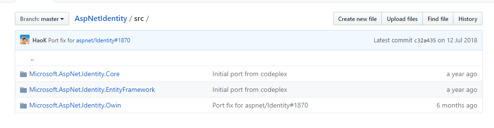
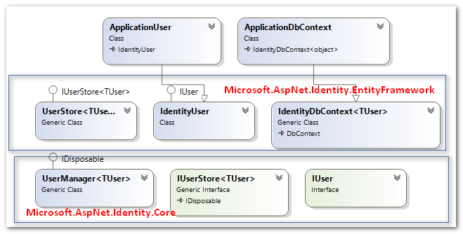

## What si membership?
> Membership是ASP.NET为我们提供的一套验证和存储用户凭证的框架。它可以帮助我们快速的开发用户登录、管理以及权限验证相关的模块。

## 如何使用membership？

参见[Membership三步曲之入门篇 - Membership基础示例](https://www.cnblogs.com/jesse2013/p/membership.html)

## Provider(提供程序模型)

> Membership的重要组成部分是MembershipProviders。要理解Membership的架构设计，我们首先要理解Provider。 要理解Membership的架构设计，我们首先要理解Provider。

### 什么是Provider？

> Provider 的全称是 Provider Model （中文是提供程序模型）。

总结为三要素：

1. **具有良好定义的共有API**：一个Provider可以是一个类，或者好几个类共同组成的一个模块，它们提供了一些特定的功能，这些特定的功能要用接口中的方法或者抽象类的抽象方法暴露出来(.NET框架中一般使用抽象类)。

2. **要有一种配置机制**：这种配置机制能够将具体的Provider与我们定义的功能集绑定起来。（功能上感觉与依赖注入类似）

3. **通过这种加载机制**：我们可以读取配置并创建Provider的具体实例传递给我们的功能API

### 优点

- 提高灵活性和可扩展性
- 隔绝*功能代码* 和具体的*数据访问代码*
- 让扩展变得简单。既可以从抽象类继承，也可以从其它具体Provider继承，只实现不一样的地方，最后只需要轻松配置就可以搞定。

### Provider中包含的设计模式

- 策略模式：将一个特性的主要功能抽象出来，允许不同的实现方式，在运行时可以任意切换到不同的实现。
- 工厂方法模式：
- 单例模式：定义一个用户创建对象的接口，让子类决定实例化哪一个类。Factory Method使一个类的实例化延迟到其子类。
- 外观模式：为一组分布在不同的子系统或者不同地方的接口提供一个统一的入口点。

## 使用ProfileProvider来扩展用户信息

使用SqlMembershipProvider时，在membership生成的表中有一张`aspnet_Profile`，它和MebershipProvider, RoleProvider一起组成了用户信息，权限管理这样一套完整的框架。

具体实现参见[从Membership 到 .NET4.5 之 ASP.NET Identity](https://www.cnblogs.com/jesse2013/p/membership-part3.html)

### Simple Membership Provider

由于`SQL Membership Provider`存在各种问题，然后后来就有了`Simple Mebership Provider`，借助于它：

1. 我们不必再依懒于Profile Provider去扩展用户信息。
2. 可以完全让Membership 根据我们自己定义的表结构来运行。
3. 与Entity Framework集成
4. 另外，在VS2012或2013中创建一个MVC4.0的Internet程序，就会为你自动添加所有代码（登录注册等相关功能）

## ASP.NET Identity（MVC5引入）

> ASP.NET Identity是在.NET Framework4.5中引入的，相较于membership，它有哪些进步呢？

1. 一套ASP.NET Identity，可以用于ASP.NET下的web form, MVC, web pages, web API等
2. 和Simple Membership Provider，可以灵活订制用户信息，同样采用EF Code First来完成数据操作
3. 完全自定义数据结构
4. 单元测试的支持
5. 与Role Provider集成 
6. 支持面向Clamis的认证
7. 支持社交账号的登录
8. OWIN 集成
9. 通过NuGet发布来实现快速迭代

[ASPNetIdentity源码地址](https://github.com/aspnet/AspNetIdentity)

### 框架设计

ASPNetIdentity的模块如下图：

- [Microsoft.AspNet.Identity.EntityFramework](http://www.nuget.org/packages/Microsoft.AspNet.Identity.EntityFramework/)

  主要包括ASP.NET Identity 的EF 部分的实现，有了EF的帮助我们就可以完全自定义数据结构，当然我们也只需要定义一个实体类就可以了。

- [Microsoft.AspNet.Identity.Core ](http://www.nuget.org/packages/Microsoft.AspNet.Identity.Core/)

  名字就已经告诉大家了，这是ASP.NET Identity的核心了，所以主要的功能在这里面。上面那个包是ASP.NET Identity EF的实现，那么我们可以在这个核心包的基础上扩展出基于No SQL, Azure Storage 的 ASP.NET Identity实现。

- [Microsoft.AspNet.Identity.OWIN](http://www.nuget.org/packages/Microsoft.AspNet.Identity.Owin/)

  ASP.NET Identity对OWIN 认证的支持。

参考文章：

[Membership三步曲之入门篇 - Membership基础示例](https://www.cnblogs.com/jesse2013/p/membership.html)

[Membership三步曲之进阶篇 - 深入剖析Provider Model](https://www.cnblogs.com/jesse2013/p/membership-part2.html)

[从Membership 到 .NET4.5 之 ASP.NET Identity](https://www.cnblogs.com/jesse2013/p/membership-part3.html)