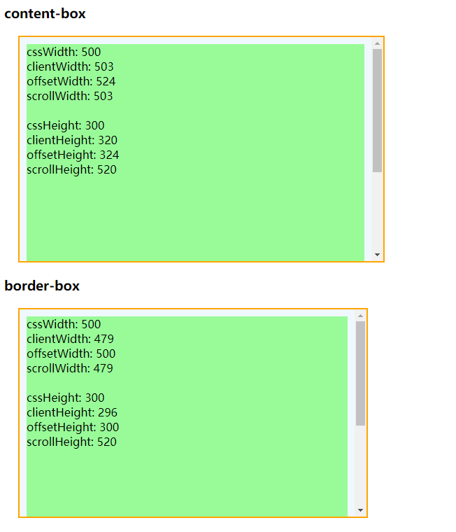

# 获取元素宽高

## clientHeight

> 只读属性，对于没有定义CSS高度或者内联布局盒子的元素为0，否则，它是元素内部的高度(单位像素)，包含内边距padding，但不包括水平滚动条、边框border和外边距margin。

## offsetHeight

> 只读属性，它返回该元素的像素高度，高度包含该元素的垂直内边距padding和边框border，但不包含外边距margin、::before或::after等伪类元素的高度，且是一个整数。
>
> 在chrome下测试，inline元素的该值不为0
>
> 这个属性值会被四舍五入为整数值，如果你需要一个浮点数值，请用 [`element.getBoundingClientRect()`](https://developer.mozilla.org/zh-CN/docs/Web/API/Element/getBoundingClientRect).

## scrollHeight

>  只读属性，当子元素高度大于父元素时，会产生滚动条，可以滚动的内容的高度就是scrollHeight，包括padding但不包括border、margin和滚动条，也包括::before和::after这样的伪类元素。（只有当overflow属性值为auto、hidden和scroll时，才包含padding-top和padding-bottom，否则只包含padding-top）


宽度参考高度取值规则即可


## 示例

```html
<h3>content-box</h3>
<div id="box" class="box">
    <div id="child" class="child"></div>
</div>
<h3>border-box</h3>
<div id="box1" class="box" style="box-sizing: border-box;">
    <div id="child1" class="child"></div>
</div>
<style>
    .box{
        width: 500px;
        height: 300px;
        padding: 10px;
        margin: 20px;
        border: 2px solid orange;
        background-color: aliceblue;
        overflow-y: scroll;
    }
    .child{
        width: 100%;
        height: 500px;
        background-color: palegreen;
        white-space: pre-line;
    }
</style>
<script>
    let box = document.getElementById('box');
    let str = `cssWidth: 500
    clientWidth: ${box.clientWidth}
    offsetWidth: ${box.offsetWidth}
    scrollWidth: ${box.scrollWidth}
    
    cssHeight: 300
    clientHeight: ${box.clientHeight}
    offsetHeight: ${box.offsetHeight}
    scrollHeight: ${box.scrollHeight}
    `
    let child = document.getElementById('child');
    child.innerHTML = str;

    let box1 = document.getElementById('box1');
    let str1 = `cssWidth: 500
    clientWidth: ${box1.clientWidth}
    offsetWidth: ${box1.offsetWidth}
    scrollWidth: ${box1.scrollWidth}

    cssHeight: 300
    clientHeight: ${box1.clientHeight}
    offsetHeight: ${box1.offsetHeight}
    scrollHeight: ${box1.scrollHeight}
    `
    let child1 = document.getElementById('child1');
    child1.innerHTML = str1;
</script>
```



## clientTop

> 一个元素顶部边框的宽度，即border-top的宽度，只读。

## offsetTop

> 当前元素顶部距离最近父元素顶部的距离，和有没有滚动条没关系，只读。

## scrollTop

> 代表在有滚动条时，滚动条向下滚动的距离，也就是元素顶部被遮住部分的高度，可读可写。


# 获取坐标

## MouseEvent.clientX

> **`MouseEvent.clientX`** 是只读属性， 它提供事件发生时的应用客户端区域的水平坐标 

## MouseEvent.offsetX

> **MouseEvent.offsetX** 规定了事件对象与目标节点的内填充边（padding edge）在 X 轴方向上的偏移量。
>
> **这是一个实验中的功能**，此功能某些浏览器尚在开发中，注意兼容性


# 获取浏览器窗口宽高

## window.innerWidth

> 只读的 Window属性 `**innerWidth**` 返回以像素为单位的窗口的内部宽度。如果垂直滚动条存在，则这个属性将包括它的宽度。

## window.innerHeight

> 浏览器窗口的视口（viewport）高度（以像素为单位）；如果有水平滚动条，也包括滚动条高度。

## window.outerWidth

> `Window.outerWidth` 获取浏览器窗口外部的宽度。表示整个浏览器窗口的宽度，包括侧边栏（如果存在）、窗口镶边（window chrome）和调正窗口大小的边框（window resizing borders/handles）。

## window.outerHeight

> `Window.outerHeight` 获取整个浏览器窗口的高度（单位：像素），包括侧边栏（如果存在）、窗口镶边（window chrome）和窗口调正边框（window resizing borders/handles）。


获取窗口宽高也可以使用`document.body.clientWidth`和`document.body.clientHeith`

**屏幕的宽：**`window.screen.width`

**屏幕的高：**`window.screen.height`


event.clientX 相对文档的水平座标
event.clientY 相对文档的垂直座标
event.offsetX 相对容器的水平坐标
event.offsetY 相对容器的垂直坐标