> Vue数据变化侦测是基于发布-订阅模式和`Object.defineProperty`数据劫持来实现的。

Vue在实例化时，通过Observer劫持并监听所有属性，然后执行compile编译DOM，找到元素中绑定的变量，再调用Watcher（在Watcher中调用getter方法）来添加对变量的订阅。在变量发生变化后更新对应的DOM元素。



我们先来实现在数据劫持中添加订阅者这个功能

```javascript
// observer.js
function observer (data) {
    // 初始化发布者
    let dep = new Dep();
    Object.keys(data).forEach(key => {
        let val = data[key];
        Object.defineProperty(data, key, {
            enumerable: true,
            configurable: true,
            get: function getter() {
                // 添加订阅者
                if (Dep.target) {
                    dep.addSub(Dep.target);
                }
                
                return val;
            },
            set: function setter(newVal) {
                if (newVal === val) return;
                val = newVal;
                // 通知订阅者
                dep.notify();
            }
        })
    })
}


function Dep() {
    // 订阅者数组
    this.subs = [];
}

Dep.prototype = {
    addSub: function (sub) {
        this.subs.push(sub);
    },
    notify: function () {
        this.subs.forEach(sub => {
            sub.update();
        })
    }
}

Dep.target = null;
```

上面这段代码在getter、setter函数中做了数据劫持，那么订阅者sub是什么呢？接下来我们来了解一下订阅者Wathcer：Watcher的主要作用是接收属性变化的通知，然后执行更新函数去更新视图。

Watcher的作用相当于React中对每个数据都应用了`shouldComponentUpdate`

```javascript
// watcher.js
function Watcher(vm, key, callback) {
    this.vm = vm;
    this.key = key;
    this.callback = callback;
    this.value = this.bindSub();
}

Watcher.prototype = {
    bindSub: function() {
        // 将自身指定为要添加的订阅者
        Dep.target = this;
        // 获取$data中的值时，自动调用了getter函数，从而添加了当前订阅者
        let val = this.vm.$data[this.key];
        // 释放当前要添加的订阅者缓存
        Dep.target = null;
        return val;
    },
    update: function() {
        let newVal = this.vm.$data[this.key];
        let oldVal = this.value;
        if (oldVal !== newVal) {
            this.value = newVal;
            this.callback.call(this.vm, newVal, oldVal);
        }
    }
}
```

Watcher在接收到通知后，在update中调用callback去更新视图，具体如何实现呢？那就需要接触到Compile

```javascript
// compile.js
function Compile(vm, el) {
    this.vm = vm;
    // Vue实例挂载元素
    this.el = document.querySelector(el);
    this.init();
}

Compile.prototype = {
    init: function() {
        if (this.el) {
            // 将挂载元素的子元素转移到Fragment中操作，提高性能
            this.fragment = this.nodeToFragment();
            // 编译Fragment
            this.compileFragment(this.fragment);
            // 将编译好的Fragment插入到挂载点
            this.el.appendChild(this.fragment);
        } else {
            console.log('DOM元素不存在');
        }
    },
    nodeToFragment: function() {
        let fragment = document.createDocumentFragment();
        let child = this.el.firstChild;
        while (child) {
            // Node.appendChild(),如果被插入的节点已经存在于当前文档的文档树中,
            // 则那个节点会首先从原先的位置移除,然后再插入到新的位置。
            // 故继续调用firstChild时会获取到el的下一个子元素。
            fragment.appendChild(child);
            child = this.el.firstChild;
        }
        return fragment;
    },
    compileFragment: function(fragment) {
        let childNodes = fragment.childNodes;
        let self = this;
        Array.prototype.slice.call(childNodes).forEach(node => {
            let reg = /\{\{(.*)\}\}/;
            let text = node.textContent;
            console.log(text,reg.exec(text));
            
            if (self.isElementNode(node)) { // 编译元素节点中的指令
                self.compileElement(node);
            } else if (self.isTextNode(node) && reg.test(text)) { // 编译文本节点中的双括号{{}}
                self.compileText(node, text, reg.exec(text)[1]);
            }
            
            // 递归编译子节点
            if (node.childNodes && node.childNodes.length) {
                self.compileFragment(node);
            }
        });
    },
    compileElement: function (node) {
        let nodeAttrs = node.attributes;
        let self = this;
        Array.prototype.forEach.call(nodeAttrs, attr => {
            let attrName = attr.name;
            if (self.isDirective(attrName)) {
                var varName = attr.value;
                var dir = attrName.substring(2);
                if (self.isEventDirective(dir)) {  // 事件指令
                    self.compileEvent(node, self.vm, varName, dir);
                } else {  // v-model 指令
                    self.compileModel(node, varName);
                }
                node.removeAttribute(attrName);
            }
        })
    },
    compileText: function (node, text, varName) {
        let self = this;
        let replaceTxt = `{{${varName}}}`;
        this.updateText(node, text, replaceTxt, this.vm[varName]);
        // 使用Watcher订阅此处变量的变化
        new Watcher(this.vm, varName, function (value) {
            self.updateText(node, text, replaceTxt, value);
        });
    },
    compileModel: function (node, varName) {
        let self = this;
        let val = this.vm[varName];
        self.modelUpdater(node, val);
        // 使用Watcher订阅v-model绑定的变量变化
        new Watcher(this.vm, varName, function (value) {
            self.modelUpdater(node, value);
        });
        
        // 监听input输入变化
        node.addEventListener('input', function(e) {
            var newValue = e.target.value;
            if (val === newValue) {
                return;
            }
            self.vm[varName] = newValue;
            val = newValue;
        });
    },
    compileEvent: function (node, vm, varName, dir) {
        var eventType = dir.split(':')[1];
        var cb = vm.methods && vm.methods[varName];

        if (eventType && cb) {
            node.addEventListener(eventType, cb.bind(vm), false);
        }
    },
    updateText: function (node, text, replaceTxt, value) {
        text = text.replace(replaceTxt, value);
        node.textContent = typeof text == 'undefined' ? '' : text;
    },
    modelUpdater: function(node, value) {
        node.value = typeof value == 'undefined' ? '' : value;
    },
    isDirective: function (attr) {
        return attr.indexOf('v-') === 0;
    },
    isEventDirective: function (dir) {
        return dir.indexOf('on:') === 0;
    },
    isElementNode: function (node) {
        return node.nodeType === 1;
    },
    isTextNode: function (node) {
        return node.nodeType === 3;
    }
}
```

我们来实现自己的Vue实例

```javascript
function MyVue (options) {
    this.$options = options;
    this.$data = options.data;
    this.$el = options.el;
    let vm = this;
    
    Object.keys(this.$data).forEach(key => {
        vm.proxyData(key);
    });
    
    this.init();
}
MyVue.prototype.init = function () {
    observer(this.$data);
    new Compile(this, this.$el);
}

MyVue.prototype.proxyData = function (key) {
    let self = this;
    Object.defineProperty(this, key, {
        enumerable: false,
        configurable: true,
        get: function proxyGetter(){
            return self.$data[key];
        },
        set: function proxySetter(newVal){
            self.$data[key] = newVal;
        }
    })
}
```

在index.html中应用MyVue

```html
<!DOCTYPE html>
<html lang="en">
<head>
    <meta charset="UTF-8">
    <meta name="viewport" content="width=device-width, initial-scale=1.0">
    <meta http-equiv="X-UA-Compatible" content="ie=edge">
    <title>MyVue</title>
</head>
<body>
    <div id="app">
        <h2>{{name}}</h2>
        <input v-model="name"/>
    </div>
    <script src="./observer.js"></script>
    <script src="./watcher.js"></script>
    <script src="./compile.js"></script>
    <script src="./myvue.js"></script>
    <script>
        new MyVue({
            el: '#app',
            data: {
                name: ''
            }
        });
    </script>
</body>
</html>
```

