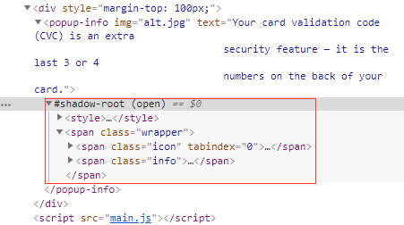

> Web Components是**一套不同的技术**，允许您创建可重用的定制元素（它们的功能封装在你的代码之外）并且在你的web应用中使用它们。

这一套技术由四项主要技术组成，它们可以一起使用来创建封装功能的定制元素。

- Custom elements（自定义元素）
- Shadow DOM
- HTML Templates（HTML模板）: ``<template>``和``<slot>``元素
- HTML Imports

下面分别介绍这四种技术的概念和用法

### Custom elements

>Custom Elements 的核心，实际上就是利用 JavaScript 中的对象继承，去继承 HTML 原生的 `HTMLElement` 类（或是具体的某个原生 Element 类，比如 `HTMLButtonElement`），然后自己编写相关的生命周期函数，处理成员属性以及用户交互的事件。

#### CustomElementRegistry对象

通过`CustomElementRegistry`对象来处理web文档中的自定义元素（custom elements）；

通过`CustomElementRegistry.define()`函数来注册一个自定义元素，有三个参数：

- 元素名称

- 一个类对象，用来定义元素的行为

  ```javascript
  // 类对象的写法
  class WordCount extends HTMLParagraphElement {
    constructor() {
      // 必须首先调用 super方法
      super();
  
      // 元素的功能代码写在这里
  
      ...
    }
  }
  ```

- 一个包含 `extends`属性的配置对象，是可选参数。它指定了所创建的元素继承自哪个内置元素，可以继承任何内置元素。

    ```javascript
    customElements.define('word-count', WordCount, { extends: 'p' });
    ```

#### 生命周期回调函数

- `connectedCallback`：当 custom element首次被插入文档DOM时，被调用。
- `disconnectedCallback`：当 custom element从文档DOM中删除时，被调用。
- `adoptedCallback`：当 custom element被移动到新的文档时，被调用。
- `attributeChangedCallback`: 当 custom element增加、删除、修改自身属性时，被调用。

#### 示例

```javascript
class WordCount extends HTMLParagraphElement{
    constructor(){
        super();

        const wcParent = this.parentNode;
        console.log(wcParent.innerText || wcParent.textContent);

        function countWords(node){
            const text = node.innerText || node.textContent;
            // 按空格切割
            return text.split(/\s+/g).length;
        }

        const count = `Words: ${countWords(wcParent)}`;

        const shadow = this.attachShadow({mode: 'open'});

        const text = document.createElement('span');
        text.textContent = count;

        shadow.appendChild(text);

        setInterval(function(){
            const count = `Words: ${countWords(wcParent)}`;
            text.textContent = count;
        }, 200);
    }
}
```


### Shadow DOM

> Shadow DOM允许将隐藏的DOM树添加到常规的DOM树中——它以shadow root为起始根节点，在这个根节点的下方，可以是任意元素，和普通DOM元素一样。不同的是，Shadow DOM内部的元素始终不会影响到它外部的元素（**隔离性**），这为封装提供了便利。

#### 相关概念

- Shadow host：一个常规DOM节点，Shadow DOM会被添加到这个节点上。
- Shadow tree：Shadow DOM内部的DOM树。
- Shadow boundary：Shadow DOM与外界的边界。
- Shadow root：Shadow tree的根节点。


#### 用法

- 附加shadow root到任一元素上。

  ```javascript
  let shadow = elementRef.attachShadow({mode: 'open'});
  let shadow = elementRef.attachShadow({mode: 'closed'});
  // open表示可以通过页面内的js方法获取Shadow DOM
  let myShadowDom = myCustomElem.shadowRoot;
  // 如果将mode设置为closed，则无法从外部获取Shadow DOM了——myCustomElem.shadowRoot将会返回null。浏览器中的某些内置元素就是这样的，例如<video>，包含了不可访问的 Shadow DOM
  
  // 如果想将Shadow DOM添加到custom element上，可以在它的构造函数中添加如下实现：
  let shadow = this.attachShadow({mode: 'open'});
  ```


#### 示例

main.html

```html
<!DOCTYPE html>
<html>
<head>
<meta charset="utf-8">
<title>shadow DOM demo</title>
</head>
<body>
    <div style="margin-top: 100px;">
        <popup-info img="alt.jpg" text="Your card validation code (CVC) is an extra 
                                    security feature — it is the last 3 or 4
                                    numbers on the back of your card.">
        </popup-info>
    </div>
<script src="main.js"></script>
</body>
</html>
```

```javascript
class PopUpInfo extends HTMLElement{
    constructor() {
        super();

        var shadow = this.attachShadow({mode: 'open'});

        var wrapper = document.createElement('span');
        wrapper.setAttribute('class', 'wrapper');
        var icon = document.createElement('span');
        icon.setAttribute('class', 'icon');
        icon.setAttribute('tabindex', 0);
        var info = document.createElement('span');
        info.setAttribute('class', 'info');
        
        // 将text属性的值，
        var text = this.getAttribute('text');
        info.textContent = text;

        // 插入图片元素
        var imgUrl;
        if (this.hasAttribute('img')) {
            imgUrl = this.getAttribute('img');
        } else {
            imgUrl = 'img/default.png';
        }
        var img = document.createElement('img');
        img.src = imgUrl;
        icon.appendChild(img);

        // 添加样式
        var style = document.createElement('style');

        style.textContent = `
        .wrapper {
            position: relative;
        }

        .info { 
            font-size: 0.8rem; 
            width: 200px; 
            display: inline-block; 
            border: 1px solid black; 
            padding: 10px; 
            background: white; 
            border-radius: 10px; 
            opacity: 0; 
            transition: 0.6s all; 
            position: absolute; 
            bottom: 20px; 
            left: 10px; 
            z-index: 3; 
        } 

        img { 
            width: 1.2rem 
        } 

        .icon:hover  .info, .icon:focus  .info { 
            opacity: 1; 
        }`;
        shadow.appendChild(style);
        shadow.appendChild(wrapper);
        wrapper.appendChild(icon);
        wrapper.appendChild(info);
    }
}

customElements.define('popup-info', PopUpInfo);
```

最终页面结构如下：



### HTML Template

> HTML Template即HTML模板，用来定义一段自定义代码结构，可以在其它地方引用，而不用复制粘贴同样的代码结构，提高了代码复用率。

#### 模板元素template

``<template>``模板元素不会被DOM渲染，但仍然能被JavaScript引用。

```html
<template id="my-paragraph">
  <p>My paragraph</p>
</template>
<script>
    let template = document.getElementById('my-paragraph');
    let templateContent = template.content;
    document.body.appendChild(templateContent);
</script>
```

#### 槽\<slot>

>``<slot>``由name属性标识，可以使用它在模板（template）中定义占位符，这样你在使用这些模板时，可以向slot中填充任意的html片段。

#### 示例

```html
<!DOCTYPE html>
<html>
<head>
<meta charset="utf-8">
<title>shadow DOM demo</title>
</head>
<body>
    <template id="my-paragraph">
      <p>My paragraph</p>
      <p><slot name="my-text">My default text</slot></p>
    </template>
    <my-paragraph>
      <ul slot="my-text">
        <li>Let's have some different text!</li>
        <li>In a list!</li>
      </ul>
    </my-paragraph>
<script src="main.js"></script>
</body>
</html>
```


```javascript
customElements.define('my-paragraph',
  class extends HTMLElement {
    constructor() {
      super();
      let template = document.getElementById('my-paragraph');
      let templateContent = template.content;

      const shadowRoot = this.attachShadow({mode: 'open'})
        .appendChild(templateContent.cloneNode(true));
  }
})
```

### HTML Imports

>已经废弃的 HTML Imports 通过 `<link>` 标签实现，只要指定 `rel="import"` 就可以了，就像这样：`<link rel="import" href="./templates.html">`，它可以接受 `onload` 和 `onerror` 事件以指示它已经加载完成。


参考文章：

[MDN Web Components](https://developer.mozilla.org/zh-CN/docs/Web/Web_Components)

[深度介绍：💾 你听说过原生 HTML 组件吗？](https://juejin.im/post/5bc7ead7f265da0afc2c2c6b#heading-5)


