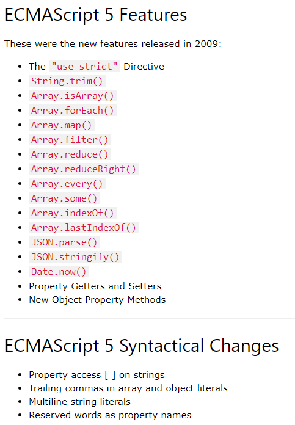
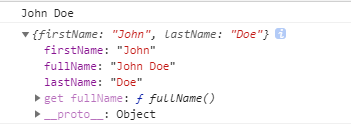
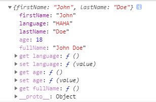

## ES5新特性概览

参见：https://www.w3schools.com/js/js_es5.asp



## 严格模式(use strict)

> 严格模式可以应用到**整个脚本**或**个别函数**中。不要在封闭大括弧 `{}` 内（代码块内）这样做，在这样的上下文中这么做是没有效果的。 

在使用严格模式时：

- 禁止给未声明的变量赋值
- 静默失败升级为错误（删除不可删除的属性、函数参数名不唯一等）
- 禁止八进制数字语法
- ECMAScript 6中的严格模式禁止设置[primitive](https://developer.mozilla.org/en-US/docs/Glossary/primitive)值的属性 
- 禁用with
-  arguments, arguments.callee不推荐使用
- 对于一个开启严格模式的函数，指定的`this`不再被封装为对象，而且如果没有指定`this`的话它值是`undefined` 
- [更多...](https://www.w3schools.com/js/js_strict.asp)


## Function

> 只要函数中的this不是想要的，就可用call/apply/bind替换

### Function.prototype.call() &&Function.prototype.apply()

> 二者的作用完全一样，只是接受参数的方式不太一样 。call 和 apply 都是为了改变某个函数运行时的 context 即上下文而存在的，换句话说，就是为了改变函数体内部 this 的指向。 当一个object没有某个方法，但是其他的有，我们可以借助call或apply用其它对象的方法来操作。 

```javascript
fun.call(thisArg, arg1, arg2, ...)
func.apply(thisArg, [argsArray])

// 示例
function Product(name, price) {
  this.name = name;
  this.price = price;
}

function Food(name, price) {
  Product.call(this, name, price);
  this.category = 'food';
}

console.log(new Food('cheese', 5).name);
// expected output: "cheese"
```


### Function.prototype.bind()

> **`bind()`**方法创建一个新的函数, 当被调用时，将其`this`关键字设置为提供的值，在调用新函数时，在任何提供之前提供一个给定的参数序列。 

```javascript
var module = {
  x: 42,
  getX: function() {
    return this.x;
  }
}

var unboundGetX = module.getX;
console.log(unboundGetX()); // The function gets invoked at the global scope
// expected output: undefined

var boundGetX = unboundGetX.bind(module);
console.log(boundGetX());
// expected output: 42
```


## ES5中的数组API

- **Array.prototype.every()**

  > every（）方法测试数组中的所有元素是否都通过了由提供的函数实现的测试。

  ```javascript
  // arr.every(callback[, thisArg])
  var arr = [1,2,3,4,5,6,7,8,9,0];
  var result1 = arr.every(function(currentValue,index,array){
      return currentValue%2 === 0;
  });
  console.log(result1); // false
  ```

  空数组调用该方法时始终返回true

- **Array.prototype.some()**

  > some（）方法测试数组中是否至少有一个元素通过了由提供的函数实现的测试。

  ```javascript
  // arr.some(callback[, thisArg])
  var result2 = arr.some(function(currentValue,index,array){
      return currentValue >= 0;
  });
  console.log(result2); // true
  ```

  空数组调用该方法时始终返回false

- **Array.prototype.forEach()**

  > forEach（）方法为每个数组元素执行一次提供的函数。

  ```javascript
  arr.forEach(function(currentValue,index,array){
      console.log(currentValue);
  });
  ```

- **Array.prototype.map()**

  > map（）方法创建一个新数组，其结果是在调用数组中的每个元素上调用提供的函数。

  ```javascript
  var result3 = arr.map(function(currentValue,index,array){
      return  ++currentValue;
  });
  console.log(result3); // [ 2, 3, 4, 5, 6, 7, 8, 9, 10, 1 ]
  ```

- **Array.prototype.filter()**

  > filter（）方法创建一个新数组，其中包含通过所提供函数实现的测试的所有元素。

  ```javascript
  var result4 = arr.filter(function(currentValue,index,array){
      return currentValue > 5;
  })
  console.log(result4); // [ 6, 7, 8, 9 ]
  ```

- **Array.prototype.reduce()**

  > reduce（）方法对累加器和数组中的每个元素（从左到右）应用函数以将其减少为单个值。

  ```javascript
  var result5 = arr.reduce(function(accumulator,currentValue,index,array){
      return accumulator + currentValue;
  });
  console.log(result5); // 45
  // 若未给accumulator设置初始值，默认取数组的第一项作为初始值，但在数组为空时会报错。
  // 设置初始值：arr.reduce(callback[, initialValue])。
  // 未设置初始值，从index=1开始遍历；设置了初始值，从index=0开始遍历。
  ```

  [利用reduce方法实现分组汇总](https://stackblitz.com/edit/js-rjenmk)


## JS属性

### 1. 数据属性

- 定义

  > 数据属性我们可以理解为我们平时定义对象时赋予的属性，它可以进行读和写。ES5中定义了一些特性，这些特性是用来描述属性的各种特征，特性是内部值，不能直接访问到。特性通过用两对方括号表示，比如`[[Enumerable]]`。属性的特性会有一些默认值，要修改特性的默认值，必须使用ES5定义的新方法`Object.defineProperty`方法来修改。

- 数据属性的四大特性
  - value：属性的值
  - writable：true/false是否可修改
  - enumerable：true/false是否可通过for-in来枚举出属性
  - configurable：true/false是否可被delete删除，是否可修改前两个属性（一旦更改为false，不可逆）

- 四大特性默认值
  - 使用`defineProperty/defineProperties`定义的属性，在位置定这些特性值时，默认为false和undefined
  - 使用`.`添加的属性，或者直接通过字面量定义的属性，特性值默认为true和给定的value


### 2. 访问器属性

> 和数据属性的区别在于，它没有数据属性的[[Writable]]和[[Value]]两个特性，而是拥有一对getter和setter函数。
>
> [[Get]]：读取属性时调用的函数，默认是undefined
> [[Set]]：设置属性时调用的函数，默认是undefined

- Getters and setters allow you to define Object Accessors (Computed Properties).

  > getters和setters允许你定义对象访问器（计算属性）

  ```javascript
  var person = {
    firstName: "John",
    lastName : "Doe",
    get fullName() {
      return this.firstName + " " + this.lastName;
    }
  };
  console.log(person.fullName); // John Doe
  console.log(person);
  ```

  输出结果如下图：
  

  ```javascript
  var person = {
    firstName: "John",
    lastName : "Doe",
    language : "NO",
    get lang() {
      return this.language;
    },
    set lang(value) {
      this.language = value;
    }
  };
  
  person.lang = 'EN';
  console.log(person.lang); // EN
  console.log(person.language); // EN
  console.log(person)
  ```

- The `Object.defineProperty()` method can also be used to add Getters and Setters

  ```javascript
  // Define object
  var person = {
    firstName: "John",
    lastName : "Doe",
    language : "EN" 
  };
  
  // Change a Property
  Object.defineProperty(person, "language", {
    get : function() { return language },
    set : function(value) { language = value.toUpperCase() }
  });
  
  // Define a new Property
  Object.defineProperty(person, "age", {
    get : function() { return age },
    set : function(value) { age = value }
  });
  
  // Define a computed Property
  Object.defineProperty(person, "fullName", {
    get : function () {return this.firstName + " " + this.lastName;}
  });
  
  person.age = 18;
  person.language = 'haha';
  console.log(person);
  ```

  输出结果如下图，可以看到，在对象中出现了对应的get、set，与第一种方式定义的结果类似

  

  

- 试图用访问器属性读取受保护的值时，自动调用get方法

- 视图用访问器属性修改受保护的值时，自动调用set方法

- 严格模式下，必须同时设置get和set

- 非严格模式下，可以只设置其中一个，如果只设置get，则属性是只读的，如果只设置set，属性则无法读取


### 3. 获取特性值

```javascript
var obj = {
    a: 1,
    b: 'haha'
};
var attr = Object.getOwnPropertyDescriptor(obj,'a');
console.log(attr); 
// 输出为：{ value: 1, writable: true, enumerable: true, configurable: true }
```


### 4. 定义/修改属性的特性值
```javascript
//修改一个属性的内部属性
Object.defineProperty(obj,'a',{writable: false});

//修改多个属性的内部属性
Object.defineProperties(obj,{
    a: {
        enumerable: false
    },
    b: {
        enumerable: false
    }
});

console.log(Object.getOwnPropertyDescriptor(obj,'a')); 
// { value: 1, writable: false, enumerable: false, configurable: true }

console.log(Object.getOwnPropertyDescriptor(obj,'b'));
// { value: 'haha', writable: true, enumerable: false, configurable: true }
```


### 5. 防扩展、密封、冻结

#### 防扩展

> - 无法添加新属性，但可以删除已有属性
> - 原型对象上还是可以添加属性的

```
Object.isExtensible(obj);
Object.preventExtensions(obj); 
```

#### 密封

> - 无法添加新属性或删除已有属性
> - 无法修改出了value以外的四大特性

```
Object.isSealed(obj);
Object.seal(obj); // 密封对象
```

#### 冻结

> 无法添加、删除、修改属性（包括四大特性），即这个对象无法被修改。

```
Object.isFrozen(obj);
Object.freeze(obj); // 冻结对象
```


## 其它新的Object方法

- `Object.getPrototypeOf(obj)`：原型对象`__proto__`
- `Object.getOwnPropertyNames(object)`：获取自有属性，返回一个数组
- `Object.keys(object)`：获取enumerable为true的属性，返回一个数组


参考文章

[MDN](https://developer.mozilla.org/zh-CN/docs/Web/JavaScript/Reference/Global_Objects/Array)

[详解JavaScript中的Object对象](http://www.cnblogs.com/lrzw32/p/5225218.html)