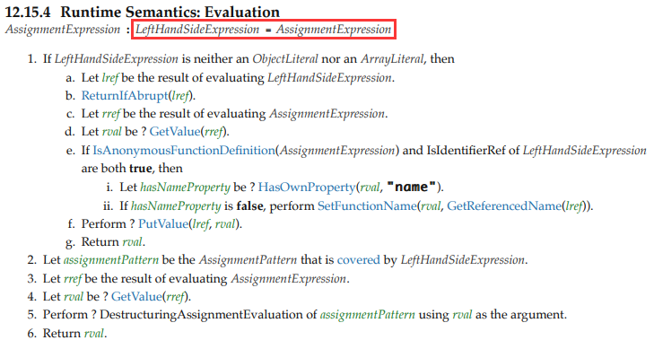

### 问题描述

```javascript
var foo = {n: 1};
var bar = foo;
foo.x = foo = {n: 2};
console.log(foo.x);
console.log(bar);
```

### 答案

`undefined`

`{n: 1, x: {n: 2}}`

### 解析

#### Ecma-262对于等号赋值表达式的规定



> 翻译：
>
> 1. 如果左边的表达式既不是Object字面量也不是Array字面量，然后
>
>       a. 让`lref`(左边的引用)指向左边表达式的计算结果
>
>       b. 返回左边表达式的值
>
>       c. 让`rref`(右边的引用)指向右边表达式的计算结果
>
>       d. 让`rval`等于`rref`指向的值
>
>       e. 若右边的表达式为匿名函数定义，且左边的表达式是一个引用类型标识符，然后
>
>       ​	1. 让`hasNameProperty= HasOwnProperty(rval, "name") `
>
>       ​	2. 若`hasNameProperty`值为false（即匿名函数还未指定名称），将匿名函数的函数名指定为`lref`
>
>       f. 将右边的值`rval`赋值给`lref`
>
>       g. 返回`rval`
>
> 2. 否则，就是AssignmentPattern（赋值模式，包括ObjectAssignmentPattern 和 ArrayAssignmentPattern），也就是对应我们的解构（**Destructuring**）语法。

#### 详解

由上可知，等号赋值表达式会先计算左右两边表达式的值，然后再将右边的值赋给左边。

`foo.x = foo = {n: 2}` <==> `foo.x = (foo = {n: 2})`

1. lref = foo.x 得到`lref = undefined`
2. rval = GetValue(rref) 得到 `rval = {n: 2}`；在这一过程中，首先完成了赋值表达式`foo = {n: 2}`，即此时`foo`指向新的引用，值为{n: 2}；`bar`还是指向原先的引用，值为{n: 1}。
3. 得到右边表达式之后再将右边的值赋值给左边的表达式。而`foo.x`指向的是`bar.x`，故bar最终的值为`{n: 1, x: {n: 2}}`，foo最终的值为`{n: 2}`