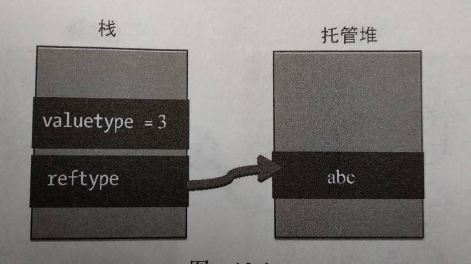

这几天遇到js参数传递方式的问题，深切探究一番，将所得结果总结于此

## 常见的几种传递方式
### 传值调用（call by value）
>在传值调用中实际参数被求值，其值被绑定到函数中对应的变量上（通常是把值复制到新内存区域）。在函数返回后调用者作用域里的曾传给函数的任何东西都不会变。
### 传引用调用（call by reference）
>在“传引用调用”求值中，传递给函数的是它的**实际参数的隐式引用**（即实际参数的地址）而不是实参的拷贝。通常函数能够修改这些参数（比如赋值），而且改变对于调用者是可见的。
### 传共享对象调用（call by sharing）
>在传共享对象调用中，传递给函数的是实参所指向引用对象的地址，而不是实参的地址，即传递共享对象。故在函数中修改引用对象时，实参的值也会跟着变化，而如果是重新给新参赋值后，再进行任何修改都不会影响到外面的实参了。

## JS中的传值方式
### Number--传值调用

```javascript
let a = 1;
function add(val) {
  val += 1;
  console.log(`val=${val}`); // 2
}

add(a);
console.log(`a=${a}`); // 1
```
### String--传值调用

```javascript
let a = 'hahaha';
function change(val) {
  val = 'heiheihei';
  console.log(`val=${val}`); // heiheihei
}

change(a);
console.log(`a=${a}`); // hahaha
```
### Boolean--传值调用
### Symbol--传值调用

```javascript
let a = Symbol('prop');
function change(val) {
  val = Symbol(2);
  console.log(`val=${val.toString()}`); // Symbol(2)
}

change(a);
console.log(`a=${a.toString()}`); // Symbol(prop)
```
### null--传值调用
### undefined--传值调用
### Object--传共享对象调用

```javascript
let obj = {
    a: 1
}
function change(obj) {
    obj.a = 2;
    console.log(obj); // {a: 2}
    obj = {
        a: 3
    }
    console.log(obj); // {a: 3}
}

change(obj);
console.log(obj); // {a: 2}
```
从上面的代码可以看出，在函数中对参数所指向的对象进行修改时会影响到外面的实参，但对函数参数重新赋值时，不会影响到实参，故js引用类型的传值方式为**call by sharing**

## 深入探究
### 变量存储方式


在``C#``中类型有两种：值类型和引用类型，它们之间的却别在于实际数据存储的位置（如上图）。值类型的变量和实际数据都存储在堆栈中；而引用类型则只有变量存储在堆栈中，变量存储着实际数据的地址，实际数据存储在与地址相对应的托管堆中。

### C#中的值传递

- 正常情况下，值类型按值传递
- 正常情况下，应用类型按共享对象的方式传递(call by sharing)，但string类型除外（由于string的不可变性，它是按值传递的）
- 通过使用ref或out关键字，值类型和引用类型都可以按引用传递

### 总结
综上所述（证明题2333），值传递和引用传递的参数类型既可以是值类型又可以是引用类型，但是call by sharing的参数类型只能是引用类型。

>个人理解：JS中，null赋值的变量时对象，但是，变量指向的引用地址为空，故在函数中修改参数的值，对实参不会又任何影响，所以是按值传递。string类型应该跟C#按值传递的原因一致。

参考：
[维基百科](https://zh.wikipedia.org/wiki/%E6%B1%82%E5%80%BC%E7%AD%96%E7%95%A5)
[JS中的值是按值传递，还是按引用传递呢](https://segmentfault.com/a/1190000005794070)
《Learning hard C#学习笔记》第10章