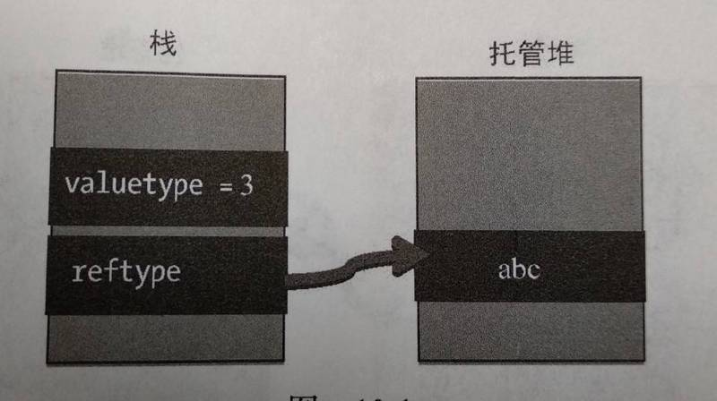

# JS深拷贝与浅拷贝

## 问题描述

> 把一个对象A的某个引用类型属性`prop1`赋值给另一个对象B的属性`prop2`，在更改`A.prop1`的值（不改变示例引用地址）后，`B.prop2`是否会改变？
>
> 输出结果显示未改变，如下

```javascript
var obj = {
    a: 1,
    b: { 
        name: 'b'
    }
}

var cloneObj = {
    c: obj.a,
    d: obj.b
}
var c = obj;

obj.a = 3;
obj.b = {name: 'bbb'}
console.log(JSON.stringify(obj)); // {"a":3,"b":{"name":"bbb"}}
console.log(JSON.stringify(cloneObj)); // {"c":1,"d":{"name":"b"}}
console.log(JSON.stringify(c)); // {"a":3,"b":{"name":"bbb"}}
```

纠结于这个问题，说明本人对深浅拷贝问题理解的还不够透彻，故来复习一遍，并记录下来。

## JS变量存储方式

JavaScript中数据类型分为基本数据类型（null、undefined、boolean、number、string、symbol）和引用数据类型两种。

基本数据类型存储在栈中，引用数据类型存储实际值存储在堆中，只在栈中保存指向实际值得引用地址。

**深拷贝和浅拷贝只是针对引用数据类型**




## 赋值与浅拷贝的区别

- 当我们把一个对象A赋值给一个新的变量B时，**赋的其实是该对象的在栈中的地址，而不是堆中的数据**。A、B为同一个对象（A === B为true）

  ```javascript
  var A = {
      a: 1,
      b: { 
          name: 'b'
      }
  };
  var B = A;
  A.a = 2;
  A.b.name = 'bbb';
  console.log(A, B); // {a: 2, b: {name: "bbb"}}  {a: 2, b: {name: "bbb"}}
  
  A.b = {age: 18}
  console.log(A, B); // {a: 2, b: {age: 18}}  {a: 2, b: {age: 18}}
  ```

- 浅拷贝是按位拷贝对象，**它会创建一个新对象**，这个对象有着原始对象属性值的一份精确拷贝。如果属性是基本类型，拷贝的就是基本类型的值；如果属性是内存地址（引用类型），拷贝的就是内存地址 ，因此如果其中一个对象改变了这个地址指向的对象，就会影响到另一个对象。

  ```javascript
  var A = {
      a: 1,
      b: { 
          name: 'b'
      }
  };
  var B =Object.assign({}, A);
  A.a = 2;
  A.b.name = 'bbb';
  console.log(A, B); // {a: 2, b: {name: "bbb"}}  {a: 1, b: {name: "bbb"}}
  
  A.b = {age: 18}
  console.log(A, B); // {a: 2, b: {age: 18}}  {a: 1, b: {name: "bbb"}}
  ```

  > 由于浅拷贝在属性为引用类型时，只拷贝其内存地址，故修改内存地址指向的对象时，拷贝获得的对象B的对应属性b也会变化；但是若直接给该属性赋新值时，对象B的属性b不会变化。

## 浅拷贝的实现方式

- `Object.assign({}, A)`   A为要拷贝的对象

- `Array.prototype.concat()`

- `Array.prototype.slice()`

  > Array的slice和concat方法不修改原数组，只会返回一个浅复制了原数组中的元素的一个新数组

## 深拷贝的实现方式

- `JSON.parse(),JSON.stringify()`

  问题：

  - 无法处理函数

  ```javascript
  var A = {
      a: 1,
      b: { 
          name: 'b'
      },
      c: function(){
          return 1;
      }
  };
  let str = JSON.stringify(A);
  console.log(str); // {"a":1,"b":{"name":"b"}} 函数丢失
  console.log(JSON.parse(str)); // {"a":1,"b":{"name":"b"}}
  ```

  - 循环引用问题

    ```javascript
      var a = {};
      a.a = a;
      
      console.log(JSON.parse(JSON.stringify(a)));
      // Uncaught TypeError: Converting circular structure to JSON
      //    at JSON.stringify (<anonymous>)
      
      console.log(deepClone(a));  
      // 如果下面的deepClone方法中没有加上针对循环引用的处理，就会报如下错误：
      // Uncaught RangeError: Maximum call stack size exceeded
    ```

- 递归复制：jQuery.extend()，lodash函数库提供的cloneDeep方法等。

  > 在递归复制中，对于除了Ojbect以外的基本数据类型以及Fucntion和Error类型，都会采用直接赋值的方式；而对于普通Object以及Array类型，会进行递归复制，直到遇到前面那些数据类型为止。

  ```javascript
  // jQuery实现原理
  function checkType (target) {
    let type = Object.prototype.toString.call(target).slice(8, -1);
    return type.toLowerCase();
  }
  
  function isPlainObject (obj) {
    if (!obj && checkType(obj) !== 'object') {
      return false;
    }
  
    let proto = Object.getPrototypeOf(obj);
    // Object.create(null)的情况
    if (!proto) {
      return true;
    }
  
    // 具有原型的对象是普通的，如果它们是由全局Object函数构造的
    let instance = {};
    let hasOwn = instance.hasOwnProperty;
    let fnToString = hasOwn.toString;
    // 获得obj的原型上的构造函数
    let Ctor = hasOwn.call(proto,'constructor') && proto.constructor;
  
    // 判断构造函数是否为Object()
    return typeof Ctor === 'function' 
      && fnToString.call(Ctor) === fnToString.call(Object);
  }
  
  function deepClone() {
    let target = arguments[0] || {};
    let i = 1;
    let length = arguments.length;
  
    if (typeof target !== 'object' && checkType(target) !== 'function') {
      target = {};
    }
  
    // 处理只有一个参数的情况
    if (i === length) {
      target = {};
      i--;
    }
    for (; i < length; i++) {
      let options = arguments[i];
      if (options !== null) {
        for (let key in options) {
          let src = target[key];
          let copy = options[key];
  
          // 防止循环引用问题（下面有提到）
          if (target === copy) {
            continue;
          }
  
          let copyIsArray = false;
          if (copy && (isPlainObject(copy) || (copyIsArray = Array.isArray(copy)))) { // 当为普通对象或数组时，进行递归复制
            let clone;
  
            if (copyIsArray) {
              clone = src && Array.isArray(src) ? src : [];
            } else {
              clone = src && isPlainObject(src) ? src : {};
            }
            // 递归
            target[key] = deepClone(clone, copy);
          } else if (copy !== undefined) { //当为基本类型，function以及new Date()等值时直接赋值
            target[key] = copy;
          }
        }
      }
    }
  
    return target;
  }
  ```

- 循环引用问题

  对于`a.a = a`的情况，我们好像在deepClone方法中解决了，但是`a.b.c = a`的情况呢，通过验证还是会报错。更详细的解决方案见参考文章第二篇。


## 问题原理解释

疑惑的原因是改变obj.b的值的方式漏掉了一种情况，修改obj.b的方式不是直接给b赋一个新值，而是更改b指向对象。

```javascript
var obj = {
    a: 1,
    b: { 
        name: 'b'
    }
}

var cloneObj = {
    c: obj.a,
    d: obj.b
}
var c = obj;

obj.a = 3;
obj.b.name = 'bbb';
console.log(JSON.stringify(obj)); // {"a":3,"b":{"name":"bbb"}}
console.log(JSON.stringify(cloneObj)); // {"a":1 ,"b":{"name":"bbb"}}
console.log(JSON.stringify(c)); // {"a":3,"b":{"name":"bbb"}}
```

所以，这种赋值方式就是一种浅拷贝而已。都是基础不扎实惹的祸！！！

参考文章：

1. [浅拷贝与深拷贝](https://github.com/ljianshu/Blog/issues/5)

2. [JavaScript深拷贝的一些坑](https://juejin.im/post/5b235b726fb9a00e8a3e4e88)

3. jQuery.extend()方法源码实现