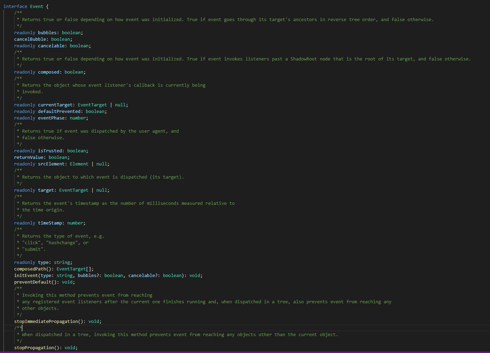

> **事件**，就是文档或浏览器窗口中发生的一些特定的交互瞬间，通过它来实现JavaScript与HTML之间的交互


### 事件流

事件流描述的是用页面中接受事件的顺序。

#### 事件冒泡

从最内层的节点开始触发事件，逐级冒泡直到顶层节点，从originTarget开始由内向外传播。

#### 事件捕捉

从顶层的父节点开始触发事件，从外到内传播，到触发事件originTarget结束。

> 根据W3C模型，事件首先被目标元素所捕获，然后向上冒泡。——《基于MVC的JavaScript Web富应用开发》

> “DOM2级事件“规定的事件流包括三个阶段：事件捕获阶段、处于目标阶段和事件冒泡阶段。——《JavaScript高级程序设计》

**注意：**不是所有的事件都支持事件冒泡的，blur、focus、load、unload、mouseenter、mouseleave以及自定义事件不支持冒泡。

####  取消事件

- 通过调用event对象的`stopPropagation()`函数来终止冒泡
- 通过调用event对象的`preventDefault()`函数来阻止默认行为；只有`cancelable`属性为true的事件才可以使用`preventDefault()`方法来取消其默认行为
- 既要终止冒泡又要阻止默认行为时，直接`return false`即可


### 事件处理程序

响应某个事件的函数就叫做事件处理程序。事件处理程序的名字以“on”开头。

#### HTML事件处理程序

指定事件处理程序的最传统方式，就是将一个函数赋值给一个事件处理程序属性（如：onclick）。

```html
<input id="btn" type="button" onclick="handleClick(this.value)" value="hello"></input>
<script>
    function handleClick(value){
        console.log(window.event);
        console.log(event);
        console.log(event.target);
        console.log('this', this); // window
        console.log(value);  // hello
        console.log(this.value);  // undefined
    }
</script>
```

> 通过这种方式指定时，会创建一个封装着元素属性值得**函数**。这个函数中有一个局部变量event（即事件对象）。通过event变量，可以直接访问事件对象，你不用自己定义它，也不用从函数的参数列表中读取（**经测试，在chrome、和IE11中不用从函数的参数列表读取，但是在fireFox中则需要**）。在这个函数内部，this值等于事件的目标元素。——《JavaScript高级编程》

上面这段话我们可以理解为：通过html属性指定事件处理程序时，在指定的处理函数外再包装一层函数，然后将这个新函数赋值给btn.onclick（见DOM0级事件处理程序），这样新函数作用于内的this就指向了事件目标元素。但是在具体的事件处理函数handler内部，由于没有 具体的调用对象，在非严格模式下它内部的this指向window

```html
// 包装一层后的函数
btn.onclick = function() {
	console.log(this === btn); // true
	handleClick(value); // 它里面的this指向window
}
```


#### DOM0级事件处理程序

使用DOM0级方法指定的事件处理程序被认为是元素的方法。

```javascript
var btn = document.getElementById("btn");
btn.onclick = function() {
    alert(this.id); // btn
}
```

#### DOM2级事件处理程序

主要就是`addEventListener`和`removeEventListener`两个方法，它们都接受3个参数：要处理的事件名、事件处理函数、一个布尔值（表示是否启用事件捕获），使用它们的主要好处就是可以添加多个事件处理程序。

**注意：**如果监听的函数是匿名函数，没有任何引用指向它，在不销毁这个元素的前提下，这个监听是无法被移除的。

#### IE事件处理程序

IE实现了`attachEvent()`和`detachEvent()`。这两个方法都接受两个参数：事件处理程序名称和事件处理函数。

- 在使用这两个函数时，事件处理程序会在全局作用域中运行，因此this指向window
- 这些事件处理程序不是以添加它们的方式运行的，而是以相反的顺序触发

#### 跨浏览器的事件处理程序

这时就需要做浏览器探测工作了，根据不同情况选用不同方案。

```javascript
function addHandler(target, eventType, handler) {

    if (target.addEventListener) { // DOM2 Events
        target.addEventListener(eventType, handler, false);
    } else if (target.attachEvent) { // IE
        target.attachEvent('on' + eventType, handler);
    } else {
        target['on' + eventType] = handler;
    }
}

function removeHandler(target, eventType, handler) {

    if (target.removeEventListener) {
        target.removeEventListener(eventType, handler, false);
    } else if (target.detachEvent) { 
        target.detachEvent('on' + eventType, handler);
    } else {
        target['on' + eventType] = null;
    }
}
```


### 事件对象

Event对象的定义如下图：



事件对象分为DOM中的事件对象和IE中的事件对象，应该是为了兼容，Event对象的中的属性和方法将这两种事件对象的属性方法都包括进去了。

#### DOM中事件对象的属性/方法

- `bubbles: boolean`表明事件是否冒泡
- `cancelable: boolean`表明是否可以取消事件默认行为
- `composed: boolean`是否是否会在shadow DOM根节点之外触发侦听器
- `currentTarget: EventTarget`当前正在调用事件处理函数的那个元素
- `defaultPrevented: boolean`为true表示已经调用了preventDefault()方法
- `eventPhase: number`调用事件处理程序的阶段：1表示捕获阶段，2表示“处于目标”，3表示冒泡阶段
- `isTrusted: boolean`表明是否是浏览器生成的事件
- `target: EventTarget`事件的目标
- `initEvent(type: string, bubbles?: boolean, cancelable?: boolean): void;`
- `preventDefault(): void`
- `stopImmediatePropagation(): void`
- `stopPropagation(): void`
- `type: string`事件类型

#### IE中的事件对象的属性/方法

- `cancelBubble: boolean`默认值为false，但将其设置为true就可以取消事件冒泡
- `returnValue: boolean`默认值为true，但将其设置为false就可以取消事件的默认行为
- `srcElement: Element`事件的目标，对应target
- `type: string`事件类型（IE中的type与DOM中的type是相同的）


### 事件委托

>通俗来讲，就是把一个元素响应事件（click、keydown等）的函数委托到另一个元素。
>
>通常会把一个或一组元素的事件委托到它的父层或者更外层元素上，真正绑定事件的是外层元素，当事件响应到需要绑定的元素上时，会通过事件冒泡机制触发。


### 自定义事件

#### 非IE浏览器

- 方式一

    ```javascript
    // 创建事件，参数为事件类型
    var event = new Event('Event'); 
    
    // 初始化事件
    // initEvent(type: string, bubbles?: boolean, cancelable?: boolean): void;
    event.initEvent('build', true, true); 
    
    elem.addEventListener('build', function(e) {
        // do something
    }, false);
    
    elem.dispatchEvent(event);
    ```

- 方式二：通过构造函数创建

    Event的构造函数定义为`new(type: string, eventInitDict?: EventInit): Event;`

    其中EventInit的定义为：

    ```typescript
    interface EventInit {
        bubbles?: boolean; // 是否冒泡，默认false
        cancelable?: boolean; // 是否可取消，默认false
        composed?: boolean; //是否是否会在shadow DOM根节点之外触发侦听器，默认false
    }
    ```

    ```javascript
    // 创建及初始化事件
    var event = new Event('build', {
        bubbles: true,
        cancelable: true
    });
    ```

#### IE8及之前浏览器

```javascript
var event = document.createEventObject(); // 不接受任何参数

// 给event的属性赋值...

elem.fireEvent('onclick', event); // 触发事件
```

在调用`fireEvent()`方法时，会自动为event对象添加`srcElement`和`type`属性；其他属性则都是必须通过手工添加的。