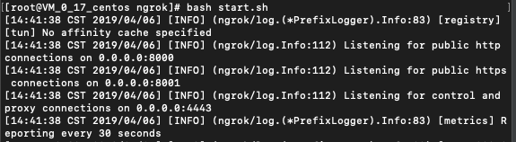
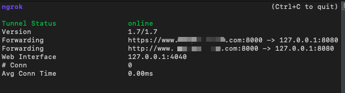
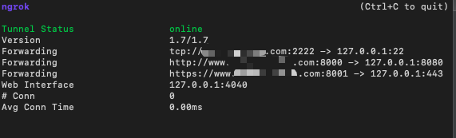

## 1.准备所需资源

- 具有公网IP的服务器一台（本人使用的是腾讯云服务器，centos6.5）

- 域名一个（example.com）

- 域名解析

  `example.com`和`*.example.com`都设置为指向前面那台服务器的IP

## 2.安装服务器环境

用于下载和编译ngrok源码（由于ngrok1.x开源，2.x不开源，这里使用的是1.7版本）

```bash
yum install gcc -y
yum install git -y
# 安装go语言环境
yum install -y mercurial git bzr subversion golang golang-pkg-windows-amd64 golang-pkg-windows-386
# 检查安装的环境
git --version //( >= 1.7 )
go version
```

## 3.下载ngrok源码

在用户目录`~`下载

```bash
git clone https://github.com/inconshreveable/ngrok.git
```

由于腾讯云主机莫名其妙无法访问github（修改hosts到指定ip无果），这里凡是涉及到git clone的操作，我都是从本地clone好再使用ftp工具传上去的。

## 4.生成证书

```bash
cd ngrok
```

将下面这段shell写入文件中执行：

```bash
export NGROK_DOMAIN="example.com"
openssl genrsa -out rootCA.key 2048  
openssl req -x509 -new -nodes -key rootCA.key -subj "/CN=$NGROK_DOMAIN" -days 5000 -out rootCA.pem  
openssl genrsa -out device.key 2048  
openssl req -new -key device.key -subj "/CN=$NGROK_DOMAIN" -out device.csr  
openssl x509 -req -in device.csr -CA rootCA.pem -CAkey rootCA.key -CAcreateserial -out device.crt -days 5000

# 移动时选择覆盖文件即可
cp rootCA.pem assets/client/tls/ngrokroot.crt
```

我是写入到setupngrok.sh中的，执行如下：

```bash
bash setupngrok.sh
```

## 5.编译生成客户端和服务端

**以下脚本都是在ngrok目录中执行**

- 生成在linux环境中运行的客户端和服务端

  ```bash
  GOOS=linux GOARCH=amd64 make release-server release-client
  # 生成的服务端文件为：./bin/ngrokd
  # 生成的客户端文件为：./bin/ngrok
  ```

- 生成在windwos环境中运行的客户端和服务端

  ```bash
  GOOS=windows GOARCH=amd64 make release-server release-client
  # 生成的服务端文件为：./bin/windows_amd64/ngrokd
  # 生成的客户端文件为：./bin/windows_amd64/ngrok
  ```

- 生成在mac OS环境中运行的客户端和服务端

  ```bash
  GOOS=darwin GOARCH=amd64 make release-server release-client
  # 生成的服务端文件为：./bin/darwin_amd64/ngrokd
  # 生成的客户端文件为：./bin/darwin_amd64/ngrok
  ```

由于我的服务端为centos，客户端为mac OS，故我生成的方式如下：

```bash
GOOS=linux GOARCH=amd64 make release-server
GOOS=darwin GOARCH=amd64 make release-client
```

## 6.配置与启动服务

- 启动服务端

  ```bash
  # 如果不携带key和crt参数会报错Failed to read message: remote error: tls: bad certificate
  # 可以使用-tunnelAddr=":端口号"指定客户端与服务端连接端口，这里省略则使用默认的4443端口
  bin/ngrokd -tlsKey=device.key -tlsCrt=device.crt -domain="feipeng123s.com" -httpAddr=":8000" -httpsAddr=":8001"
  ```

  执行上述命令后，若显示下面的结果，则表示服务启动成功

  

  **请确保连接端口4443，http代理端口8000，https代理端口8001在服务器安全组中已开放，否则无法连接**

- 启动客户端

  **简易配置**

  将ngrok客户端拷到本地文件夹，在当前目录中新建ngrok.cfg配置文件，配置如下：

  ```bash
  server_addr: "example.com:4443" # 客户端和服务端的默认连接端口为4443
  trust_host_root_certs: false
  ```

  在客户端ngrok所在目录执行下面的命令：

  ```bash
  ./ngrok -config=ngrok.cfg -subdomain=www 8080 
  # subdomain用于指定二级域名，若不指定，则由ngrok随机生成
  ```

  连接成功后，会显示如下，这里默认配置http和https都代理到本地的8080端口

  

  **详细配置**

  ```bash
  # ngrok.cfg
  server_addr: "example.com:4443"
  trust_host_root_certs: false
  tunnels:
    http:
      subdomain: "www"
      proto:
        http: "8080"
        
    https:
      subdomain: "www"
      proto:
        https: "443"
   
    ssh:
      remote_port: 2222
      proto:
        tcp: "22"
  ```

  ```bash
  # 启动命令
  ngrok -config=ngrok.cfg start http https ssh
  ```

  

参考文章：

1. [Centos搭建Ngrok实现内网穿透](<https://www.jianshu.com/p/796c3411f8eb>)
2. [LINUX | 在centos 7下配置ngrok服务器穿透内网](https://www.vediotalk.com/?p=58)
3. [Using ngrok to proxy internal servers in restrictive environments](<https://shubs.io/using-ngrok-to-proxy-internal-servers-in-restrictive-environments/>)


