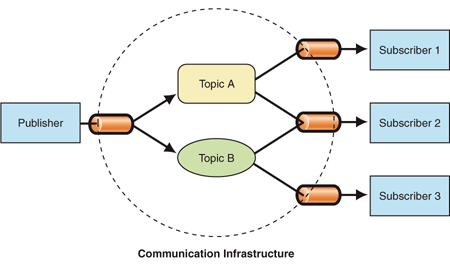

## 观察者模式

> 观察者模式：定义对象间的一种一对多依赖关系，使得每当一个对象状态发生改变时，其相关依赖对象皆能得到通知并被自动更新。


### JavaScript实现


```javascript
function Subject () {
  var observers = [];
  return {
    attach: function(observer) {
      if (!observers.includes(observer)) {
        observers.push(observer);
      }
    },
    detach: function(observer) {
      if (observers.includes(observer)) {
        observers.forEach((val,index) => {
          if (val === observer) {
            observers.splice(index, 1);
          }
        })
      }
    },
    notify: function(msg) {
      observers.forEach(val => {
        val.handler(msg);
      })
    }
  }
}

function Observer (handler) {
  this.handler = handler;
}

function handler1 (msg) {
  console.log(`observer1 get new message: ${msg}`);
}
function handler2 (msg) {
  console.log(`observer2 get new message: ${msg}`);
}
let subject = new Subject();
let observer1 = new Observer(handler1);
let observer2 = new Observer(handler2);

subject.attach(observer1);
subject.attach(observer2);
subject.notify('test message1');
subject.detach(observer2);
subject.notify('test message2');

// output:
// observer1 get new message: test message1
// observer2 get new message: test message1
// observer1 get new message: test message2
```

## 解耦(发布-订阅模式)

> 发布-订阅模式不再由被观察对象（Subject）直接发送给观察者，而是通过中介的方式，由发布者（Publisher）向指定订阅者（Subscriber），实现了观察者与被观察者之间的松散耦合。



### JavaScript实现

```javascript
function Publisher () {
  var subscribers = {};
  return {
    attach: function (topic, subscriber) {
      if (subscribers[topic]) {
        if (!subscribers[topic].includes(subscriber)) {
          subscribers[topic].push(subscriber);
        }
      } else {
        subscribers[topic] = [subscriber];
      }
    },
    detach: function (topic, subscriber) {
      if (subscribers[topic] && subscribers[topic].includes(subscriber)) {
        subscribers[topic].forEach((val,index) => {
          if (val === subscriber) {
            subscribers[topic].splice(index, 1);
          }
        })
      }
    },
    notify: function (topic, msg) {
      if (subscribers[topic]) {
        subscribers[topic].forEach(val => {
          val.handler(msg);
        })
      }
    }
  }
}


function Subscriber (handler) {
  this.handler = handler;
}

function handler1 (msg) {
  console.log(`subscriber1 get new message: ${msg}`);
}
function handler2 (msg) {
  console.log(`subscriber2 get new message: ${msg}`);
}
let publisher = new Publisher();
let subscriber1 = new Subscriber(handler1);
let subscriber2 = new Subscriber(handler2);

publisher.attach('topic1', subscriber1);
publisher.attach('topic1', subscriber2);
publisher.notify('topic1', 'test message1');
publisher.detach('topic1', subscriber2);
publisher.notify('topic1', 'test message2');

// output:
// subscriber1 get new message: test message1
// subscriber2 get new message: test message1
// subscriber1 get new message: test message2
```

## 两种模式之间的区别

- 发布订阅模式为松散耦合，观察者和被观察者之间通过中介（发布者）进行通信
- 发布订阅模式可扩展性强

参考文章：

[观察者模式 vs 发布-订阅模式](<https://juejin.im/post/5a14e9edf265da4312808d86>)

